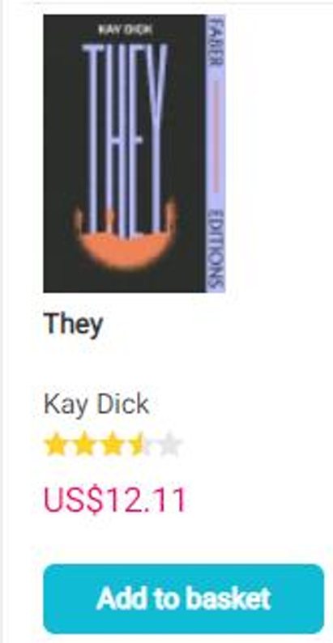
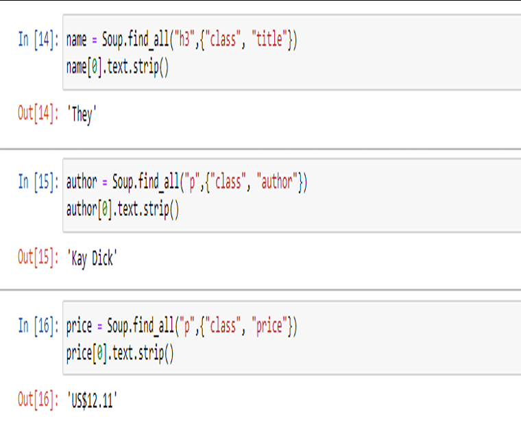

# 📚 Book Depository Scraper – Science Fiction

This project scrapes book data from the "Science Fiction" category on Book Depository using Python's requests and BeautifulSoup libraries. It extracts useful information such as the book's title, author, price, rating, and book cover.

🔗 Target URL:  
http://www.bookdepository.com/category/2626/Science-Fiction

## 📌 Features

- 🔍 Scrapes science fiction books from the Book Depository site
- 🖋️ Extracts:
  - Title
  - Author
  - Price
  - Rating
-  Saves results locally
-  Displays book image and data side by side

## 🖼️ Book Scraping Output

### 📘 Original book image from the website

### 📄 Extracted book data using web scraping

## Technologies Used

- Python
- requests
- BeautifulSoup (bs4)
- lxml
